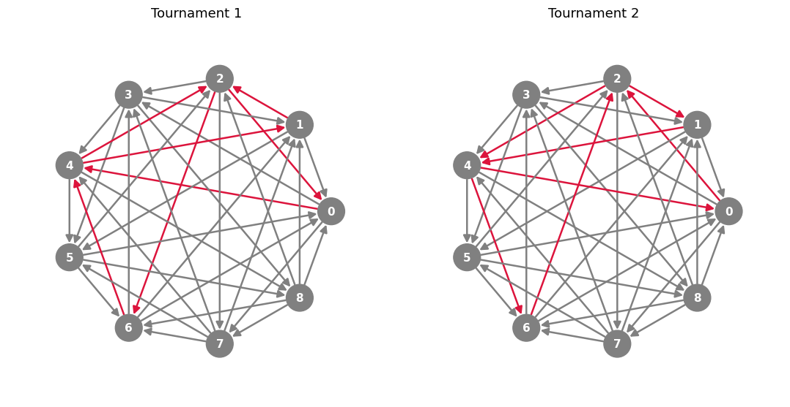

## How to use:

- 📁 tournament_data: contains txt files storing all tournaments up to 9 vertices. Data is taken from Brendan McKay ([see here](https://users.cecs.anu.edu.au/~bdm/data/digraphs.html)) and tournaments are represented in upper triangular form (e.g., arcs of a tournament on 4 vertices [1,2,3,4] are stored in order 12-13-14-23-24-34, where ij = 1 if there is an arc from i to j and ij = 0 if there is an arc from j to i).
- 📄 generate_database.py: Python file that takes in tournament files (upper triangular form) or d6 files (see Brendan McKay for documentation) and returns a JSON file storing (among others) the dichromatic polynomial of a digraph (as defined [here](https://link.springer.com/article/10.1007/s00373-022-02484-0)) and the spectra of the adjacency $(A(D))$, walk adjacency $(W_A(D))$, hermitian $(H(D))$, walk hermitian $(W_H(D))$, skew symmetric $(S(D))$, and walk skew symmetric $(W_S(D))$ matrices of the graph. The matrices of a digraph $D$ are defined as follows:
  
$A(D): [a_{jk}] = 1$ if $jk$ is an arc in the digraph;\
$H(D): [h_{jk}] = 1$ if $jk, kj$ are arcs in the digraph, $[h_{jk}] = i$ if $jk$ is an arc and $kj$ is not, $[h_{jk}] = -i$ if $kj$ is an arc and $jk$ is not, $[h_{jk}] = 0$ else;\
$S(D):$ (only defined for oriented graphs!) $[h_{jk}] = 1$ if $jk$ is an arc and $kj$ is not, $[h_{jk}] = -1$ if $kj$ is an arc and $jk$ is not, $[h_{jk}] = 0$ else;\
$W_M(D): [e, Me, M^2e, \ldots, M^{n-1}e]$, where $e$ is an all-ones vector and $M$ is an $n\times n$ matrix.

- 🔗 If you want to download the generated data for all tournaments up to 9 vertices, click [here](https://github.com/Katiekuehr/cospectral_dichro_diff_tournaments/releases/download/v1.0/tourn_to_n9.json).
- 📄 cospectral_groups.py: Python file that classifies all $(A(D), W_A(D)), (H(D), W_H(D)), (S(D), W_S(D))$ cospectral groups of tournaments with more than $1$ tournaments. For each group, it checks pairwise whether for two digraphs $D_1, D_2$ every arc $jk$ in the set $S =$ { $jk: jk \in D_1, jk \not \in D_2$ } is in a directed cycle, which is a subset of $S$.

## Results:

Up to $n = 9$, there are $50$ $(A(D), W_A(D))$-cospectral and 50 $(H(D), W_H(D))$-cospectral groups of graphs with differing dichromatic polynomial ($(S(D), W_S(D))$ not tested; all $50$ groups are constituted of tournaments on 9 vertices). The groups are identical between $(A(D), W_A(D))$ and 50 $(H(D), W_H(D))$. The smallest group contains $2$ tournaments and the largest $6$, all groups are stored in _mate_groups.txt_. All digraphs in a group pairwise satisfy that every arc $jk$ in the set $S =$ { $jk: jk \in D_1, jk \not \in D_2$ } is in a directed cycle, which is a subset of $S$.
